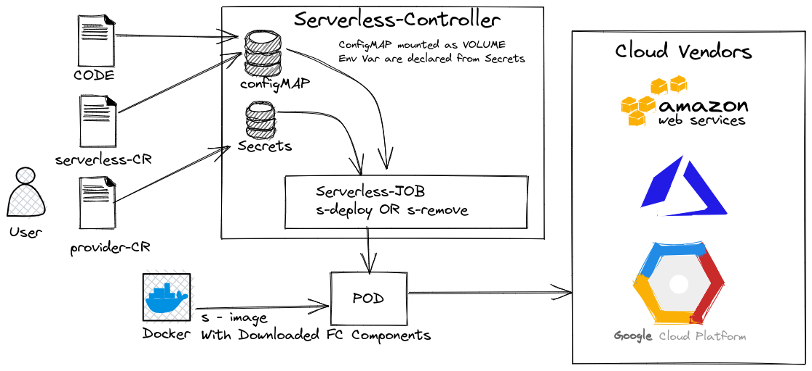

# Serverless-k8s-operator
The operator is used to manage the life-cycle of the Serverless-devs application. 

## Description
The operator provide s deploy when you create a serverless Resource and s remove when you delete a serverless Resource so that you can deploy and remove the application on the your provider/vendors. You need to add the provider credential which would be stored in sercrets of the k8s cluster. 

## Design of Controller 


## Getting Started
You’ll need a Kubernetes cluster to run against. You can use [KIND](https://sigs.k8s.io/kind) to get a local cluster for testing, or run against a remote cluster.
**Note:** Your controller will automatically use the current context in your kubeconfig file (i.e. whatever cluster `kubectl cluster-info` shows).

### Running on the cluster
1. Install Instances of Custom Resources:

```sh
kubectl apply -f config/samples/
```

2. Build and push your image to the location specified by `IMG`:
	
```sh
make docker-build docker-push IMG=<some-registry>/k8s-operator:tag
```
	
3. Deploy the controller to the cluster with the image specified by `IMG`:

```sh
make deploy IMG=<some-registry>/k8s-operator:tag
```

### Uninstall CRDs
To delete the CRDs from the cluster:

```sh
make uninstall
```

### Undeploy controller
UnDeploy the controller to the cluster:

```sh
make undeploy
```
